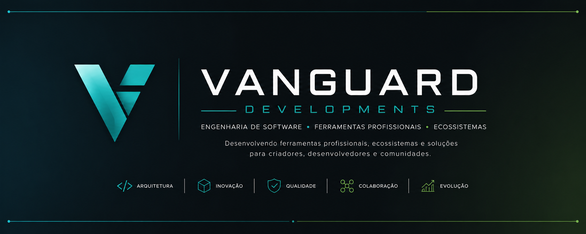

<p align="center">
    
</p>

<p align="center">


<h1 align="center">Vanguard Developments</h1>

<p align="center">
<strong>Engenharia de Software • Ferramentas • Ecossistemas</strong>
</p>

<p align="center">
Desenvolvendo ferramentas profissionais, ecossistemas e soluções para desenvolvedores, criadores e comunidades.
</p>

---

## 🚀 Produtos

### Vanguard Studio
Editor profissional para desenvolvimento de recursos GTA V/FiveM.

### PilotFiles
Ferramentas para SketchUp.

### lnOS
Plataforma para interfaces e aplicações.

### Microferramentas FiveM
Conjunto de utilitários voltados para desenvolvedores da plataforma FiveM.

---

## 📦 Projetos

| Projeto | Status |
|---------|:------:|
| 🚧 Vanguard Studio | Em desenvolvimento |
| 🚧 PilotFiles | Em desenvolvimento |
| 🚧 lnOS | Em desenvolvimento |
| 🚧 Microferramentas FiveM | Em desenvolvimento |

## 🎯 Nossa Visão

Construir um ecossistema completo de ferramentas profissionais para desenvolvedores, criadores de conteúdo, empresas e comunidades, oferecendo soluções modernas, intuitivas e de alta qualidade.

---

## 🏗️ Áreas de Atuação

- 💻 Desenvolvimento de Software
- 🎮 Ferramentas para GTA V e FiveM
- 🧩 Plugins e Extensões
- 🎨 Design de Interfaces (UI/UX)
- ☁️ Soluções para Criadores e Comunidades
- 🚀 Pesquisa e Inovação

---

# Filosofia

## 🏛️ Filosofia Vanguard

```text
Entender
    ↓
Planejar
    ↓
Projetar
    ↓
Implementar
    ↓
Validar
    ↓
Documentar
    ↓
Registrar
```

---

<p align="center">
  <strong>Vanguard Developments</strong><br>
  Engenharia de Software • Ferramentas • Ecossistemas
</p>

<p align="center">
  © 2026 Vanguard Developments
</p>

---

<p align="center">
Ecossistema Vanguard • Em desenvolvimento ativo
</p>